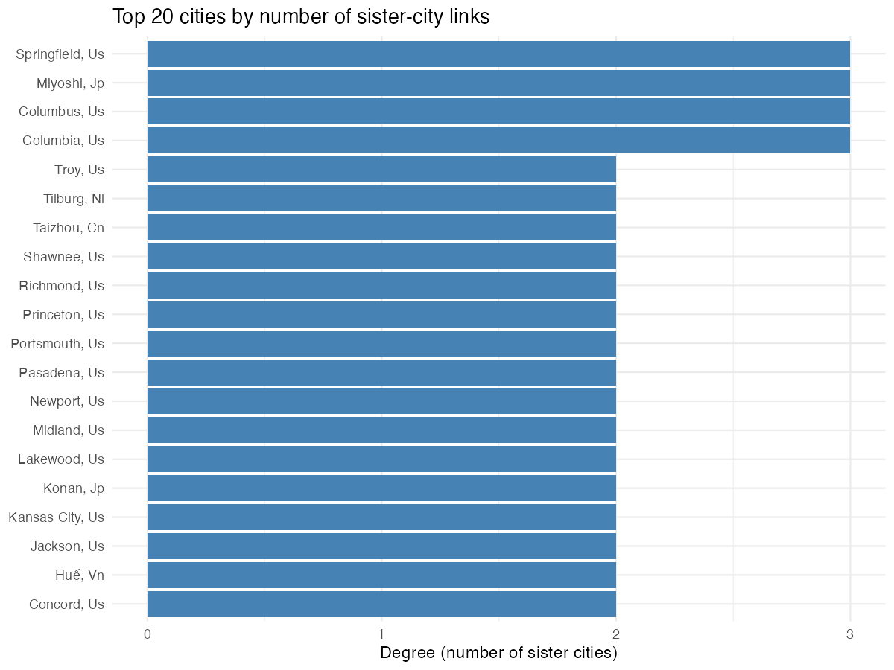
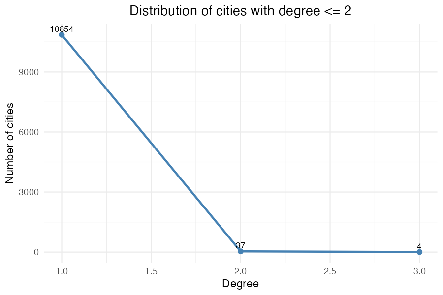

These dataset are about *twinned cities (sister cities)* around the world. The data was collected from Wikipedia and includes information about the cities and their-sister city relationships. The analysis focuses on the degree of connections between cities, which is the number of sister-city links each other city has.

The questions that we can answer through these graphs are

1\) Which cities have the most sister-city connections?

2\) How many cities have only one sister-city connections?

3\) What is the distribution of cities by their degree of connections?

```{r}
#| label: setup
#| include: false

library(tidyverse)
library(readr)

# load nodes produced by analysis
nodes <- read_csv('output/nodes.csv', show_col_types = FALSE)
smaller <- nodes %>% filter(degree <= 2)
```

## Top 20 cities by degree

```{r, echo=FALSE}
# Show the top-20 bar chart generated earlier

```

This bar chart ranks cities by their degree (number of sister-city links). Higher bars indicate cities connected to more sister cities. The table and figure help identify hubs in the sister-city network — cities that act as connectors to multiple partners.

We have data about `r nrow(nodes)` cities. Only `r nrow(nodes %>% filter(degree > 2))` have 3 degrees with other cities. The distribution of the remainder is shown below:

```{r}
#| label: plot-fewer-twinned-cities
#| echo: false

# Use the pre-generated image for consistent rendering

```

The line plot shows the number of cities by degree (including degrees 1–3). Most cities have degree = 1 (single sister-city link). According to the analysis, the counts are: degree = 1: 10,854; degree = 2: 37; degree = 3: 4. These numbers indicate the network is largely composed of pairs, with only a few cities having multiple connections.
