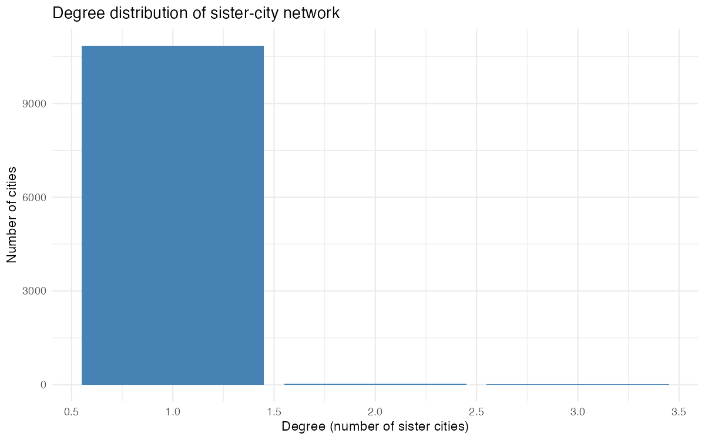
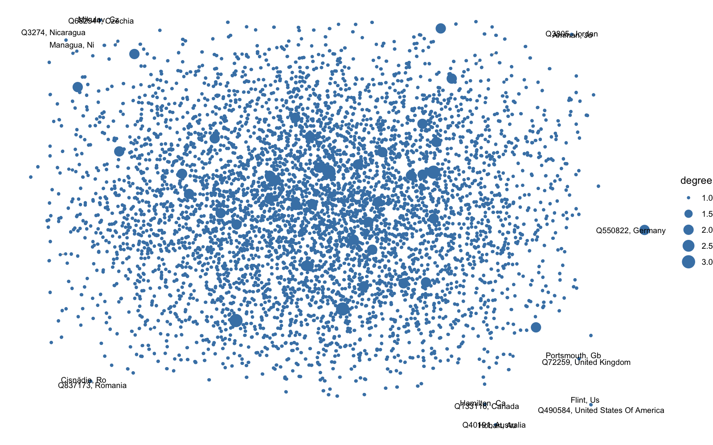

```{r setup, include=FALSE}
suppressPackageStartupMessages({
  library(tidyverse)
  library(knitr)
  library(knitr)
})
# Ensure analysis outputs exist
source('../analysis/sister_cities_analysis.R')
nodes <- read_csv('../output/nodes.csv', show_col_types = FALSE)
```

# Top cities by degree

```{r}
nodes %>% arrange(desc(degree)) %>% slice_head(n = 20) %>% kable()
```

# Degree distribution

```{r, echo=FALSE}

```

# Network plot

```{r, echo=FALSE}

```

# Degree summary

```{r}
degree_summary <- read_csv('../output/degree_summary.csv', show_col_types = FALSE)
degree_summary %>% kable()
```
